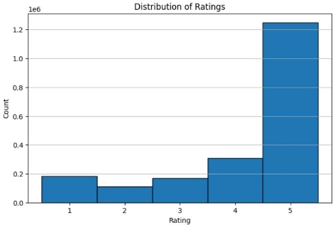
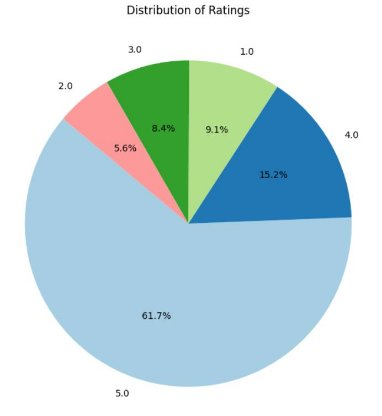

# Amazon Recommendation System

Course : Data Science Name : Alireza Rahmati

## Introduction:

In the era of vast online marketplaces, creating effective recommendation systems is a paramount challenge to enhance user experience and engagement. This project focuses on constructing two distinct recommendation systems, namely content-based and user-based, for a dataset comprising approximately 2 million records from an online retail platform.

Challenges:

The primary challenges encompass the sheer scale of the dataset, necessitating scalable and efficient algorithms, and the absence of explicit user-item interactions, prompting the exploration of content-based approaches. The goal is to provide users with personalized product recommendations, addressing the inherent complexities of diverse product categories and user preferences.

Approach:

To address these challenges, a two-fold strategy is employed. The content-based recommendation system leverages a product's textual descriptions and features, utilizing TF-IDF and dimensionality reduction with TruncatedSVD. Simultaneously, the user-based recommendation system tackles the collaborative filtering problem by implementing Singular Value Decomposition (SVD) on the extensive user-item interaction matrix.

This report delineates the technical intricacies and methodologies undertaken to implement these recommendation systems, offering insights into the algorithms, preprocessing steps, and evaluation metrics employed to quantify the performance of each model.

Collaborative Recommendation System

Preprocessing

At the outset, our initial exploration focused on understanding our dataset. We aimed to identify the available columns, examine the data types, and comprehend the information conveyed by each feature. Subsequently, we conducted feature cleaning, addressing missing values and duplicates. In the following phase, we engaged in feature engineering to enhance the quality of our dataset.

Now, let's delve into the aspects we encountered in our data.

We conducted a thorough check for missing and duplicate values, and it was determined that there are none present in the dataset.

One notable column in our database is labeled 'Timestamp.' Recognizing that this column did not contribute meaningful information, we proceeded to transform it into a standardized and informative date-time format.

After converting the 'Timestamp' column to a datetime format, I sought to identify the minimum and maximum time values within this column.

Minimum Date: 1970-01-01 00:00:00.908755200 Maximum Date: 1970-01-01 00:00:01.406073600

The results revealed that all data entries were collected on 1970-01-01 00:00, with differences only at the second level. Consequently, as this column did not

provide any meaningful information, we made the decision to remove it from

our database.

I am excited to explore the distribution of the 'Rating' feature. Let's take a closer look.

Let's visualize it using a different method.

We also performed additional visualizations. We examined the average rating and the average rating per each product. Additionally, we printed the Top 10 users with the highest count of ratings and the Top 10 products with the highest count of ratings.

Average count of ratings per user: 1.6715842980621696 Average count of ratings per product: 8.115848423822781

Top 10 users with the highest count of ratings: UserId

A3KEZLJ59C1JVH 389

A281NPSIMI1C2R 336

A3M174IC0VXOS2 326

A2V5R832QCSOMX 278

A3LJLRIZL38GG3 276

ALQGOMOY1F5X9 275

AKMEY1BSHSDG7 269

A3R9H6OKZHHRJD 259

A1M04H40ZVGWVG 249

A1RRMZKOMZ2M7J 225

Name: count, dtype: int64

Top 10 products with the highest count of ratings: ProductId

B001MA0QY2 7533

B0009V1YR8 2869

B0043OYFKU 2477

B0000YUXI0 2143

B003V265QW 2088

B000ZMBSPE 2041

...

B004OHQR1Q 1885

B00121UVU0 1838

B000FS05VG 1589

Collaborative Recommendation System Algorithm

In this phase, we dived into the realm of building a recommendation algorithm and assessing the effectiveness of our system. Our initial steps included encoding user and product identifiers (UserId and ProductId) using LabelEncoder and scaling the rating data using MinMaxScaler. However, our journey encountered a significant hurdle: our dataset boasts a whopping 2 million entries, which proved to be a formidable challenge given our limited memory resources.

To overcome this memory constraint, we embraced the Singular Value Decomposition (SVD) technique. Think of SVD as a wizard behind the scenes, a mathematical method that helps our system make sense of the vast amount of data. It's like having a clever assistant that sifts through the information and distills it into key patterns.

The magic of SVD lies in its ability to break down the complex data into simpler components. This not only allows us to represent our data more efficiently but also helps us navigate through the colossal dataset without overwhelming our system. It's akin to finding the essence of a story amidst a sea of words.

After applying SVD to our entire dataset during the training phase, we unveiled

a model that exhibited promising performance and accuracy. Our evaluation metrics, specifically the Root Mean Squared Error (RMSE), provided insights into how well our system predicts user ratings. The RMSE value of **0.3906** indicates that our model has a good grasp on user preferences.

Moving beyond the training phase, we subjected our model to a test set to simulate real-world scenarios. The resulting **RMSE** on the test set, also at **0.3906**, signifies that our recommendation system is robust and reliable when confronted with new data.

Content-Based Recommendation System

Preprocessing

In this section as before , our initial exploration focused on understanding our dataset. We aimed to identify the available columns, examine the data types, and comprehend the information conveyed by each feature. Subsequently, we conducted feature cleaning, addressing missing values and duplicates. In the following phase, we engaged in feature engineering to enhance the quality of our dataset.

At the outset, our exploration aimed at understanding the nature of our dataset. To achieve this, we performed various checks such as examining the data's shape, inspecting the list of columns, and conducting other relevant assessments.

Once armed with a clearer picture of our dataset, our next focus turned to identifying and handling missing values. Upon inspecting the dataset, we discovered the following missing values:

index 0 product 1 category 0 sub\_category 0 brand 1 sale\_price 0 market\_price 0 type 0 rating 8626 description 115

The features 'rating,' 'brand,' 'product,' and 'description' contain missing values. For 'description,' 'brand,' and 'product,' the count of missing values is relatively small, and we opted to remove them since filling them with informative values may not be practical.

However, addressing the missing values in the 'rating' feature required a different strategy due to the substantial number of missing entries. I employed a specialized algorithm to fill in the missing ratings. Specifically, I filled the rating for each product with the average rating derived from the available data for that product. In cases where there was no rating data for a particular product, I assigned a default value of 2. I chose this value because it strikes a balance, considering that products with no ratings may not necessarily evoke extreme sentiments from customers, who may choose not to express their opinions by leaving a rating.

There are no duplicate values in this dataset.

Text Preprocessing

In the text preprocessing phase, we meticulously transformed raw product descriptions into a format suitable for machine learning algorithms. This involved several key steps:

**Tokenization**: Tokenization is the process of breaking down a sequence of text into individual units, typically words or phrases, known as tokens. In our context, we applied tokenization to the product descriptions, converting them into a structured format that the computer can analyze. The Natural Language Processing (NLP) tool used for tokenization parsed the text into discrete units, enabling subsequent processing steps to operate on a more granular level.

**Remove Stop Words and Punctuation:**Common English stop words and punctuation were removed to focus on the essential words contributing to the product descriptions. This step enhanced the relevance of features in subsequent analyses.

**Lemmatization:**Lemmatization involves reducing words to their base or root form, ensuring consistency and coherence in textual data. For instance, lemmatizing verbs would convert variations like "running" and "ran" to their common base form, "run." This step is crucial for standardizing the language in the dataset, enabling more effective analysis and feature extraction.

**TF-IDF (Term Frequency-Inverse Document Frequency):**

TF-IDF is a numerical statistic that reflects the importance of a word in a document relative to a collection of documents. It combines two components: Term Frequency (TF), which measures how often a term appears in a document, and Inverse Document Frequency (IDF), which gauges the rarity of the term across the entire dataset. The resulting TF-IDF score highlights words that are both frequent within a document and unique across the dataset. This technique transforms the textual data into a numerical representation, preserving semantic meaning and aiding in content-based recommendation.

**Memory Challenges:**

The TF-IDF matrix can become memory-intensive, especially when dealing with a large dataset. The matrix represents the entire vocabulary of words across all documents, resulting in a potentially massive and sparse matrix. In scenarios where the dataset is extensive, processing the TF-IDF matrix may lead to memory allocation challenges. To mitigate this, we employed strategies such as limiting the number of features, using sparse matrix representations, and exploring incremental learning approaches. These measures ensured that the computational requirements remained manageable, enabling the efficient extraction of features for the subsequent recommendation systems.

The result of these preprocessing steps was a refined and standardized textual representation of product descriptions, ready for further feature extraction and recommendation model development. This meticulous preparation of textual data is instrumental in ensuring the efficacy and interpretability of the subsequent recommendation systems.

Feature Extraction:

**TF-IDF Vectorization:**

TF-IDF, a fundamental feature extraction technique, transforms the textual content of product descriptions into numerical vectors. Each product description becomes a vector in a high-dimensional space, with the importance of each word quantified by its TF-IDF score. This process captures the unique characteristics of each product description and establishes a foundation for content-based recommendation. However, as the dataset size increases, the TF-IDF matrix can become memory-intensive.

**Memory Optimization with SVD:**

To address memory challenges associated with the TF-IDF matrix, we applied Singular Value Decomposition (SVD) in conjunction with sparse matrix representations. SVD decomposes the TF-IDF matrix into three matrices: U, Σ, and V^T. By utilizing a sparse matrix format, which efficiently stores only non-zero entries, we substantially reduce the memory footprint. Additionally, SVD's dimensionality reduction capability allowed us to retain the most relevant information while mitigating the impact of noise in the data.

**Numerical Scaling of Other Features:**

Simultaneously, numerical features such as "sale\_price," "market\_price," and "Rating" underwent standardization. This involved scaling these features to have zero mean and unit variance. Standardizing numerical features ensures uniformity, preventing one feature from dominating others during the recommendation model's training process.

**Combining TF-IDF and Numerical Features:**

The TF-IDF vectors and standardized numerical features were then concatenated to create a comprehensive feature set. This combined feature matrix encapsulates both textual and numerical aspects of product descriptions, forming the basis for the subsequent recommendation models.

In adopting these approaches, we successfully addressed the memory challenges associated with large-scale feature extraction, enabling the development of robust and efficient content-based recommendation systems.

In the evaluation phase, cosine similarity is computed for items in the training set using a content-based recommendation model. The model's performance is assessed through precision and recall metrics, quantifying its ability to recommend relevant items. The `get\_top\_recommendations` function identifies the top N similar items based on cosine similarity scores. To handle sparse matrices efficiently, a function, `sparse\_to\_set`, converts them into a set of indices. The `evaluate\_recommendations` function iterates through the test set, comparing top recommendations with actual user interactions. **Precision (0.2629)** reflects the ratio of relevant items among recommended ones, while recall assesses the proportion of successfully recommended relevant items. These metrics provide a comprehensive evaluation of the recommendation model's accuracy and effectiveness in suggesting items to users based on their preferences.

Precision: 0.26286443148689204

This project addresses the challenge of developing effective recommendation systems for a large-scale online retail dataset. Two models were implemented: a content-based system utilizing TF-IDF and TruncatedSVD for feature extraction, and a user-based system employing Singular Value Decomposition (SVD) on a vast user-item interaction matrix. Text preprocessing involved tokenization, stop word removal, lemmatization, and TF-IDF vectorization. Memory challenges associated with large TF-IDF matrices were mitigated using sparse matrix representations and SVD. Evaluation metrics, including precision and recall, were employed to assess the recommendation models' performance. The content-based model achieved a precision of 0.2629, indicating its capability to accurately recommend relevant products based on textual content. The combination of these approaches demonstrates a comprehensive and technically sound solution for enhancing user experience in online retail through personalized recommendations.
